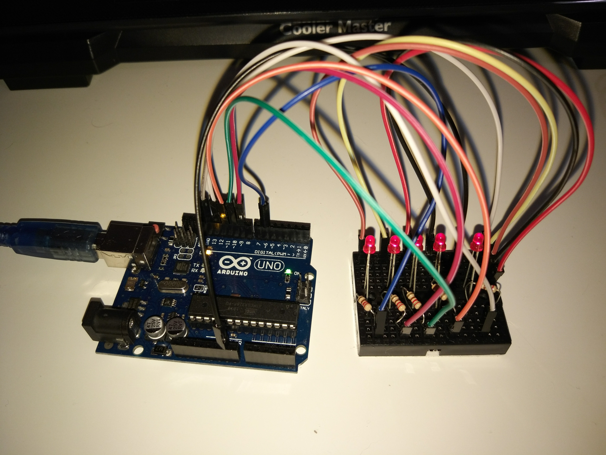

# Alarm

Simple 'alarm' using 4 LEDs with increasing intensity to indicate how much time is left - like a digital hourglass.

Circuit setup is very simple - just have 4 LEDs connected to PWM pins, and a 5th LED which will be used for blinking once the time has ended.

